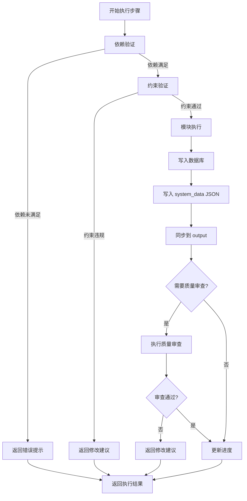
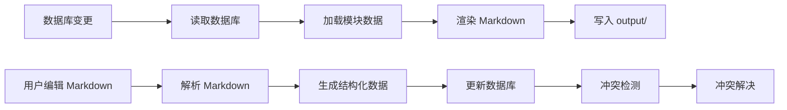
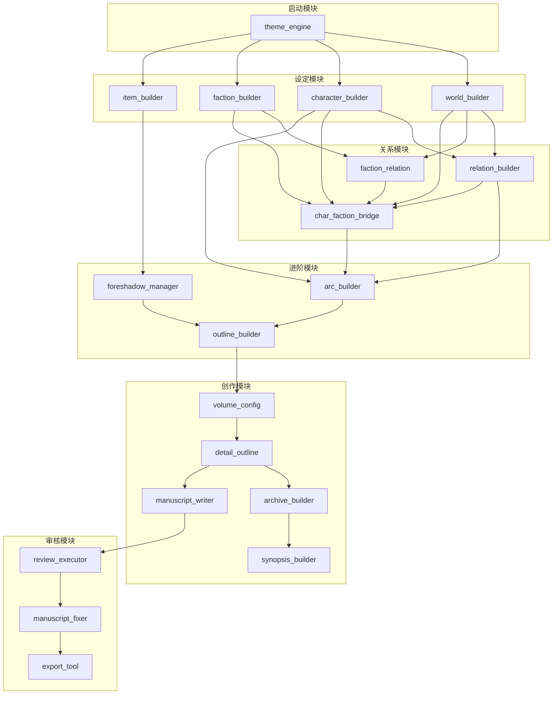
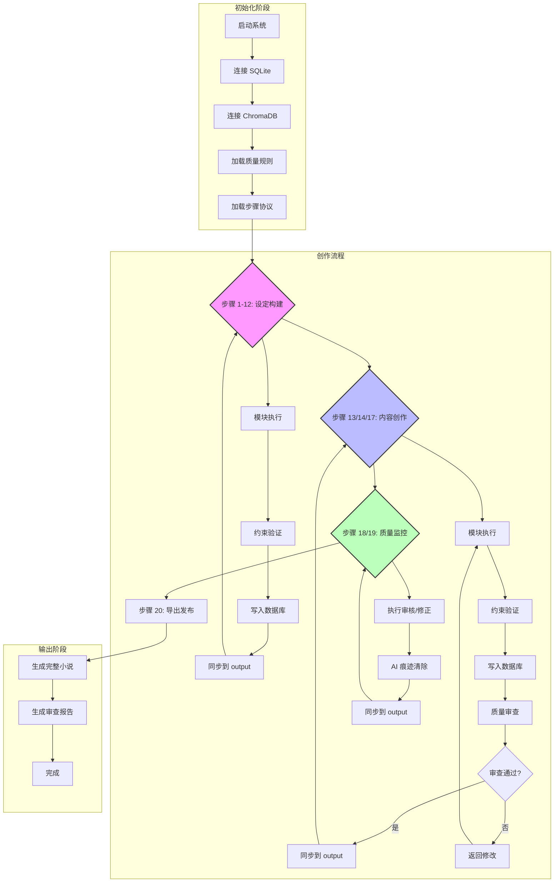
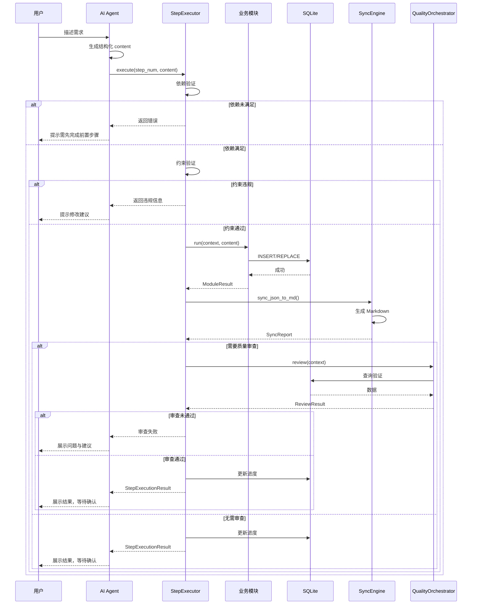
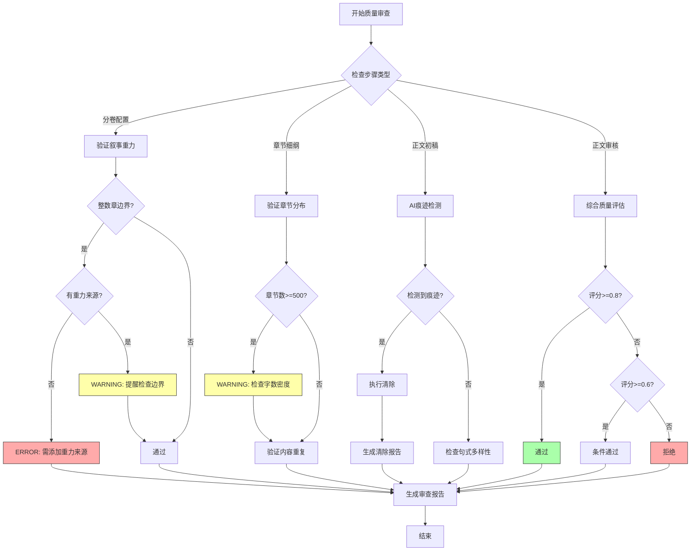
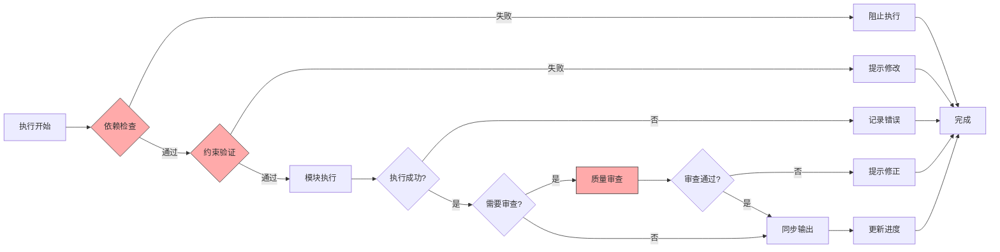

# AI 小说创作系统 — 项目分析文档

> **版本**: v3.0 (Agent-Native 原生版)
> **编制日期**: 2026-06-02
> **文档状态**: 正式版
> **核心定位**: AI Agent 直接执行的技能式小说创作系统 + 用户可视中文 Markdown 双层架构

---

## 目录

1. [项目概述](#一项目概述)
2. [项目执行流程梳理](#二项目执行流程梳理)
3. [功能模块与核心能力详述](#三功能模块与核心能力详述)
4. [项目工作流可视化](#四项目工作流可视化)
5. [质量保障体系](#五质量保障体系)
6. [数据同步机制](#六数据同步机制)
7. [关键技术指标](#七关键技术指标)
8. [风险评估与应对机制](#八风险评估与应对机制)

---

## 一、项目概述

### 1.1 项目定位

**核心使命**：为创作者提供 AI 驱动的小说创作辅助工具，实现从灵感构思到正文完稿的全流程支持。

**架构特点**：
- **Agent-Native**：AI Agent 直接运行 Python 代码，无需启动外部服务
- **零基础设施**：SQLite + ChromaDB（均为本地文件）
- **双层架构**：用户可视层（Markdown）+ 系统引擎层（JSON）
- **质量总控**：内置质量审查与 AI 痕迹清除体系

### 1.2 技术栈

| 类别 | 技术 | 版本要求 | 用途 |
|------|------|---------|------|
| 语言 | Python | ≥3.10 | 核心开发语言 |
| 数据库 | SQLite | 内置 | 主数据存储 |
| 向量搜索 | ChromaDB | ≥0.4.24 | 伏笔相似度检测 |
| 文本处理 | jieba | ≥0.42.1 | 中文分词（AI痕迹检测） |
| 配置 | PyYAML | ≥6.0.1 | YAML 配置文件解析 |
| 模板 | Jinja2 | ≥3.1.3 | Markdown 渲染 |
| 日志 | structlog | ≥24.1.0 | 结构化日志 |

### 1.3 项目结构

```
AI小说创作系统/
├── main.py                    # 系统入口
├── config.py                  # 全局配置
├── requirements.txt           # 依赖清单
├── src/
│   ├── config/               # 配置层
│   ├── core/                 # 核心业务层（模块/工作流/质量/净化/同步）
│   ├── ai/                   # AI 能力层（Prompts）
│   ├── storage/              # 数据存储层（数据库/向量库）
│   └── utils/                # 通用工具
├── tests/                    # 测试套件
├── scripts/                  # 工具脚本
├── reference/                # 参考小说库
├── output/                   # 生成输出（按小说标题命名）
├── data/                     # 运行时数据（SQLite/ChromaDB）
├── logs/                     # 日志输出
└── system_data/              # 系统引擎层 JSON 数据
```

---

## 二、项目执行流程梳理

### 2.1 阶段划分与核心任务

| 阶段 | 名称 | 核心任务 | 关键里程碑 | 交付物 |
|------|------|----------|-----------|--------|
| **启动阶段** | 灵感启动 | 需求分析、主题确定 | 灵感方向确认 | 灵感方向文档 |
| **规划阶段** | 设定构建 | 世界观、人物、势力设计 | 设定文档完成 | 完整设定集 |
| **执行阶段** | 内容创作 | 大纲、分卷、细纲、正文 | 正文初稿完成 | 完整小说初稿 |
| **监控阶段** | 质量审查 | 四层审查、AI痕迹清除 | 审查通过 | 审查报告 |
| **收尾阶段** | 导出发布 | 格式转换、最终验证 | 小说发布 | 发布格式文件 |

### 2.2 详细执行步骤（20步管线）

#### 阶段一：启动（步骤 1-2）

| 步骤 | 环节名 | 模块 | 依赖 | 交付物 | 负责人 |
|------|--------|------|------|--------|--------|
| 1 | 灵感启动 | theme_engine | — | 3个灵感方向 | Agent |
| 2 | 小说主题 | theme_engine | 1 | 三层主题结构 | Agent |

**决策评审点**：用户确认灵感方向和主题结构后进入下一阶段

---

#### 阶段二：规划（步骤 3-12）

| 步骤 | 环节名 | 模块 | 依赖 | 交付物 | 负责人 |
|------|--------|------|------|--------|--------|
| 3 | 世界观设定 | world_builder | 2 | 8维度规则集 | Agent |
| 4 | 人物设定 | character_builder | 3 | 人物四层档案 | Agent |
| 5 | 势力设定 | faction_builder | 3 | 势力组织架构 | Agent |
| 6 | 物品库 | item_builder | 3 | 关键物品清单 | Agent |
| 7 | 人物关系 | relation_builder | 4 | 人物关系网 | Agent |
| 8 | 势力关系 | faction_relation | 5 | 势力关系网 | Agent |
| 9 | 人物-势力关联 | char_faction_bridge | 4,5,7,8 | 关联映射 | Agent |
| 10 | 角色弧线 | arc_builder | 4,7,9 | 角色成长轨迹 | Agent |
| 11 | 伏笔追踪 | foreshadow_manager | 4,5,6 | 伏笔清单 | Agent |
| 12 | 拟定大纲 | outline_builder | 1-11 | 三幕式大纲 | Agent |

**决策评审点**：大纲确认后进入执行阶段

---

#### 阶段三：执行（步骤 13-17）

| 步骤 | 环节名 | 模块 | 依赖 | 交付物 | 负责人 | 需质检 |
|------|--------|------|------|--------|--------|--------|
| 13 | 分卷配置 | volume_config | 12 | 分卷规划 | Agent | ✅ |
| 14 | 章节细纲 | detail_outline | 13 | 章节场景设计 | Agent | ✅ |
| 15 | 小说档案 | archive_builder | 1-14 | 完整设定档案 | Agent | — |
| 16 | 小说简介 | synopsis_builder | 15 | 多版本简介 | Agent | — |
| 17 | 正文初稿 | manuscript_writer | 14 | 章节正文 | Agent | ✅ |

**决策评审点**：质量审查通过后进入监控阶段

---

#### 阶段四：监控（步骤 18-19）

| 步骤 | 环节名 | 模块 | 依赖 | 交付物 | 负责人 | 需质检 |
|------|--------|------|------|--------|--------|--------|
| 18 | 正文审核 | review_executor | 17 | 审查报告 | Agent | ✅ |
| 19 | 正文修正 | manuscript_fixer | 18 | 修正后正文 | Agent | ✅ |

**决策评审点**：修正完成且二次审查通过后进入收尾阶段

---

#### 阶段五：收尾（步骤 20）

| 步骤 | 环节名 | 模块 | 依赖 | 交付物 | 负责人 | 需质检 |
|------|--------|------|------|--------|--------|--------|
| 20 | 导出发布 | export_tool | 19 | 发布格式文件 | Agent | — |

---

### 2.3 单步执行流程



---

## 三、功能模块与核心能力详述

### 3.1 模块架构总览

```
src/core/modules/
├── base_module.py          # 基类：统一接口 run(context, content)
├── registry.py             # 模块注册表
├── theme_engine.py         # 主题引擎（步骤1-2）
├── world_builder.py        # 世界观构建器（步骤3）
├── character_builder.py    # 人物构建器（步骤4）
├── faction_builder.py      # 势力构建器（步骤5）
├── item_builder.py         # 物品构建器（步骤6）
├── relation_builder.py     # 人物关系构建器（步骤7）
├── faction_relation.py     # 势力关系构建器（步骤8）
├── char_faction_bridge.py  # 人物-势力关联桥接器（步骤9）
├── arc_builder.py          # 角色弧线构建器（步骤10）
├── foreshadow_manager.py   # 伏笔管理器（步骤11）
├── outline_builder.py      # 大纲构建器（步骤12）
├── volume_config.py        # 分卷配置器（步骤13）
├── detail_outline.py       # 章节细纲构建器（步骤14）
├── archive_builder.py      # 档案构建器（步骤15）
├── synopsis_builder.py     # 简介构建器（步骤16）
├── manuscript_writer.py    # 正文编写器（步骤17）
├── review_executor.py      # 审核执行器（步骤18）
├── manuscript_fixer.py     # 正文修正器（步骤19）
└── export_tool.py          # 导出工具（步骤20）
```

### 3.2 核心模块能力详解

#### 3.2.1 主题引擎（theme_engine）

**核心能力**：
- 灵感方向生成（3个差异化方向）
- 主题深度挖掘（表层/深层/情感钩子）
- 反向确认机制

**业务价值**：奠定小说创作基调，指导后续所有创作决策

**用户场景**：用户提供初步想法 → 系统生成灵感方向 → 用户选择 → 系统提炼主题结构

**关键指标**：
- 创新度评分 ≥ 0.7
- 情感潜力评分 ≥ 0.8
- 三个方向余弦相似度 < 0.6

**输出结构**：
```json
{
  "directions": [
    {"id": "DIR-001", "title": "...", "concept": "...", "innovation_score": 0.85}
  ],
  "theme": {
    "surface_theme": "...",
    "deep_theme": "...",
    "emotional_hook": "...",
    "theme_statement": "..."
  },
  "sub_themes": [{"name": "...", "core_question": "..."}]
}
```

---

#### 3.2.2 世界观构建器（world_builder）

**核心能力**：
- 8维度世界设定（物理规则、地理空间、时间历史、社会结构、文化习俗、科技水平、魔法体系、经济体系）
- 规则系统设计与约束定义
- 规则冲突检测

**业务价值**：建立自洽的故事世界框架

**用户场景**：基于主题生成完整的世界观规则集

**关键指标**：
- 8个维度全覆盖
- 每维度至少2条规则
- 规则冲突检测通过率 100%

**输出结构**：
```json
{
  "dimensions": [
    {
      "name": "魔法体系",
      "rules": [
        {"description": "...", "scope": "...", "constraints": "...", "conflicts_with": [...]}
      ]
    }
  ]
}
```

---

#### 3.2.3 人物构建器（character_builder）

**核心能力**：
- 四层人物档案构建（身份/心理/能力/特殊）
- 情感身体词典设计
- 语气指纹设定

**业务价值**：塑造立体鲜活的人物形象

**用户场景**：生成主角及配角的完整档案

**关键指标**：
- 至少3个核心角色
- 主角必须有秘密（layer4）
- 每层档案完整性 100%

**输出结构**：
```json
{
  "characters": [
    {
      "char_id": "CHAR-001",
      "name": "...",
      "role": "protagonist",
      "layer1_identity": {...},
      "layer2_psychology": {...},
      "layer3_ability": {...},
      "layer4_special": {...},
      "weight_score": 1.0
    }
  ]
}
```

---

#### 3.2.4 势力构建器（faction_builder）

**核心能力**：
- 势力层级架构设计
- 宗旨与目标制定
- 阵营标注（九阵营系统）

**业务价值**：构建故事冲突的组织基础

**用户场景**：设计小说中的势力组织

**关键指标**：
- 至少2个势力
- 不同阵营比例均衡
- 宗旨与目标明确

**输出结构**：
```json
{
  "factions": [
    {
      "faction_id": "FAC-001",
      "name": "...",
      "ideology": "...",
      "structure": {"leadership": "...", "hierarchy": "...", "membership": "..."},
      "goals": [...],
      "alignment": "守序善良"
    }
  ]
}
```

---

#### 3.2.5 伏笔管理器（foreshadow_manager）

**核心能力**：
- 8种伏笔类型设计
- 向量相似度去重（ChromaDB）
- 伏笔密度曲线规划
- 全生命周期追踪

**业务价值**：确保伏笔的有效埋设与回收

**用户场景**：在大纲基础上设计伏笔网络

**关键指标**：
- 与已有伏笔余弦相似度 < 0.85
- 重要性 > 0.7 的伏笔必须有揭晓计划
- 伏笔分布均匀度 ≥ 0.7

**输出结构**：
```json
{
  "foreshadows": [
    {
      "foreshadow_id": "FORE-001",
      "type": "信息伏笔",
      "plant_chapter": 5,
      "reveal_chapter_planned": 40,
      "payload": "...",
      "importance": 0.9
    }
  ],
  "density_curve": [...]
}
```

---

#### 3.2.6 大纲构建器（outline_builder）

**核心能力**：
- 三幕式结构设计（设置/对抗/解决）
- 因果链梳理
- 节奏热力图生成

**业务价值**：建立完整的故事结构框架

**用户场景**：整合所有设定生成小说大纲

**关键指标**：
- 三幕结构完整（第一幕20-30%，第二幕40-50%，第三幕20-30%）
- 因果链完整性 ≥ 90%
- 节奏曲线至少3次峰值变化

**输出结构**：
```json
{
  "acts": [
    {"act": 1, "name": "第一幕：觉醒", "chapters": 20, "summary": "...", "key_events": [...]}
  ],
  "causal_chain": [{"from_event": "...", "to_event": "...", "cause_type": "直接因果"}],
  "rhythm_map": [{"chapter_range": "1-10", "tension": 0.6, "pace": "medium"}]
}
```

---

#### 3.2.7 分卷配置器（volume_config）

**核心能力**：
- 叙事重力边界定义
- 章节范围规划
- 节奏控制

**业务价值**：合理划分叙事段落，控制阅读节奏

**约束规则**：
- ❌ 禁止整数章强迫症（必须以叙事重力为边界）
- ✅ 每卷必须有 boundary_gravity 说明

**输出结构**：
```json
{
  "volumes": [
    {
      "name": "弃子觉醒",
      "chapter_range": [1, 40],
      "boundary_gravity": [{"type": "narrative_gravity", "description": "..."}],
      "pacing": "fast",
      "major_conflict": "...",
      "cliffhanger": "..."
    }
  ]
}
```

---

#### 3.2.8 正文编写器（manuscript_writer）

**核心能力**：
- 场景级正文生成
- 字数预算控制
- 多层规则注入

**强制规则**：
- 必须注入 `manuscript_writer.md` 规则集
- 开篇钩子法则（前三章完成悬疑层→威胁层→超越层）
- 每800字必须有信息揭露/情绪变化/悬念强化/场景切换至少1项
- 禁止直接告知情感（禁止"他感到"）

**关键指标**：
- 字数误差 ≤ ±20%
- AI痕迹检测通过率 ≥ 95%
- 句式多样性评分 ≥ 0.8

---

### 3.3 辅助模块能力

#### 3.3.1 质量审查模块（QualityOrchestrator）

**核心能力**：
- 四层质量审查（设定一致性、逻辑链、文学质量、读者参与度）
- AI痕迹检测（6大特征）
- 自动修复建议生成

**检测特征**：
| 特征 | 描述 | 检测方法 |
|------|------|----------|
| 句式单调性 | 连续相似结构 | NLP模式匹配 |
| 过渡词滥用 | "然而"、"因此"过度使用 | 词频统计 |
| 情感空洞 | "非常高兴"等抽象描述 | 规则匹配 |
| 比喻陈腐 | "像雪一样白"等 | 相似度对比 |
| 对话不自然 | 缺乏口语特征 | 句法分析 |
| 描述模式化 | 固定描写套路 | 模板匹配 |

---

#### 3.3.2 AI痕迹清除模块（AITracePurifier）

**清除策略**：
| 级别 | 处理方式 | 适用场景 |
|------|----------|----------|
| L1 | 自动修复 | 词汇替换、句式调整 |
| L2 | 半自动修复 | 需要人工确认的中等问题 |
| L3 | 人工审查 | 严重问题需人工处理 |

---

#### 3.3.3 同步引擎（SyncEngine）

**核心能力**：
- JSON → Markdown 渲染
- Markdown → JSON 解析
- 冲突检测与解决

**同步流程**：


---

### 3.4 模块依赖关系图



---

## 四、项目工作流可视化

### 4.1 整体工作流架构



### 4.2 单环节交互流程（三明治模式）



### 4.3 质量审查决策流程



---

## 五、质量保障体系

### 5.1 审查层级

| 级别 | 名称 | 处理方式 | 示例 | 阻塞性 |
|------|------|----------|------|--------|
| BLOCKER | 阻塞 | 必须修复才能继续 | 内容重复、约束违规 | 是 |
| ERROR | 错误 | 建议修复，可跳过 | 严重逻辑矛盾 | 否 |
| WARNING | 警告 | 建议优化 | 句式单调、词汇重复 | 否 |
| INFO | 信息 | 参考建议 | 风格建议 | 否 |

### 5.2 质量审查规则分类

| 分类 | 规则内容 | 检查模块 |
|------|----------|----------|
| 结构规则 | 叙事结构、章节分布、节奏控制 | outline_builder, volume_config |
| 内容规则 | 逻辑一致性、伏笔回收、人物弧线 | character_builder, foreshadow_manager |
| 语言规则 | 句式多样性、词汇丰富度、情感表达 | manuscript_writer |
| AI痕迹规则 | 检测并清除 AI 写作特征 | purifier |

### 5.3 质量评分标准

| 指标 | 权重 | 评分范围 | 合格标准 |
|------|------|----------|----------|
| 设定一致性 | 30% | 0-1 | ≥0.8 |
| 逻辑链完整性 | 25% | 0-1 | ≥0.85 |
| 文学质量 | 25% | 0-1 | ≥0.75 |
| 读者参与度 | 20% | 0-1 | ≥0.8 |

---

## 六、数据同步机制

### 6.1 双层架构

```
┌─────────────────────────────────────────────────────────────┐
│                    用户可视层 (output/)                       │
│                         Markdown                            │
│  ├── 小说概览.md                                           │
│  ├── 01 主题/01_主题.md                                    │
│  ├── 02 世界观/02_世界观.md                                 │
│  ├── ...                                                   │
│  └── 审查报告/                                             │
├─────────────────────────────────────────────────────────────┤
│                    系统引擎层 (system_data/)                  │
│                          JSON                               │
│  ├── novel_manifest.json                                   │
│  ├── modules/                                             │
│  │   ├── theme/theme.json                                  │
│  │   ├── world/rules/RULE-001.json                         │
│  │   ├── characters/CHAR-001.json                          │
│  │   └── ...                                               │
│  └── structure/                                            │
│      ├── outlines.json                                     │
│      ├── volumes.json                                      │
│      └── detail_outlines.json                              │
└─────────────────────────────────────────────────────────────┘
```

### 6.2 输出目录结构规范

```
output/{小说标题}/
├── 01 主题/01_主题.md
├── 02 世界观/02_世界观.md
├── 03 势力/03_势力.md
├── 04 势力关系/04_势力关系.md
├── 05 人物/05_人物.md
├── 06 人物关系/06_人物关系.md
├── 07 角色弧线/07_角色弧线.md
├── 08 物品仓库/08_物品仓库.md
├── 09 伏笔管理/09_伏笔管理.md
├── 10 大纲/10_大纲.md
├── 11 分卷/11_分卷.md
├── 12 细纲/12_细纲.md
├── 13 正文/13_正文.md
├── 审查报告/
│   ├── 质量审查报告.md
│   └── AI痕迹清除报告.md
└── 小说概览.md
```

---

## 七、关键技术指标

### 7.1 性能指标

| 指标 | 目标值 | 测量方式 |
|------|--------|----------|
| 单步执行时间 | ≤ 30秒 | 从调用 execute() 到返回结果 |
| 质量审查时间 | ≤ 10秒/章节 | 四层审查总耗时 |
| AI痕迹清除时间 | ≤ 5秒/章节 | 检测+清除总耗时 |
| 同步时间 | ≤ 2秒 | JSON → Markdown 渲染 |

### 7.2 质量指标

| 指标 | 目标值 | 测量方式 |
|------|--------|----------|
| 设定一致性通过率 | ≥ 95% | 审查规则匹配率 |
| AI痕迹清除率 | ≥ 95% | 检测到的痕迹被清除的比例 |
| 约束违规率 | ≤ 5% | 约束验证失败次数/总执行次数 |
| 内容重复率 | ≤ 2% | 余弦相似度检测 |

### 7.3 可用性指标

| 指标 | 目标值 | 测量方式 |
|------|--------|----------|
| 系统可用性 | ≥ 99.9% | 成功执行次数/总执行次数 |
| 数据完整性 | 100% | 数据库约束满足率 |
| 故障恢复时间 | ≤ 1分钟 | 从错误到恢复的时间 |

---

## 八、风险评估与应对机制

### 8.1 风险识别与评估

| 风险 | 等级 | 影响 | 触发条件 |
|------|------|------|----------|
| 质量审查失败 | 高 | 无法进入下一环节 | 关键规则违反 |
| AI痕迹检测失败 | 中 | 输出质量下降 | 检测算法误判 |
| 数据同步冲突 | 中 | 数据不一致 | 用户同时编辑 |
| 性能瓶颈 | 低 | 执行时间过长 | 大规模小说创作 |
| 存储容量不足 | 低 | 无法保存数据 | 生成内容过多 |

### 8.2 应对机制

| 风险 | 应对策略 | 责任人 |
|------|----------|--------|
| 质量审查失败 | 提供详细错误信息和修改建议，支持回退到上一步 | Agent |
| AI痕迹检测失败 | 提供人工审查通道，支持分级清除策略 | Agent |
| 数据同步冲突 | 实现乐观锁机制，提供冲突解决界面 | SyncEngine |
| 性能瓶颈 | 引入异步处理，支持章节分批生成 | StepExecutor |
| 存储容量不足 | 定期清理历史数据，支持外部存储扩展 | 系统管理员 |

### 8.3 关键控制点



---

## 附录：数据库表结构概览

| 表名 | 核心字段 | 主键 |
|------|----------|------|
| novels | id, title, current_step, status | id |
| inspirations | novel_id, direction_id, title, innovation_score | (novel_id, direction_id) |
| themes | novel_id, surface_theme, deep_theme, emotional_hook | id |
| world_rules | novel_id, rule_id, dimension, description | (novel_id, rule_id) |
| characters | novel_id, char_id, name, role, layer1-4_json | (novel_id, char_id) |
| relations | novel_id, relation_id, char_a_id, char_b_id, type | (novel_id, relation_id) |
| factions | novel_id, faction_id, name, type, ideology | (novel_id, faction_id) |
| foreshadows | novel_id, foreshadow_id, type, plant_chapter, importance | (novel_id, foreshadow_id) |
| outlines | novel_id, acts, causal_chain, rhythm_map | id |
| volumes | novel_id, volume_id, name, chapter_range | (novel_id, volume_id) |
| detail_outlines | novel_id, chapter_number, scenes | id |
| manuscripts | novel_id, chapter_number, title, scenes | id |
| review_results | novel_id, step_number, level, score | id |
| step_status | novel_id, step_number, status | id |

---

**文档版本**: v1.0  
**最后更新**: 2026-06-02  
**文档位置**: `docs/项目分析文档.md`