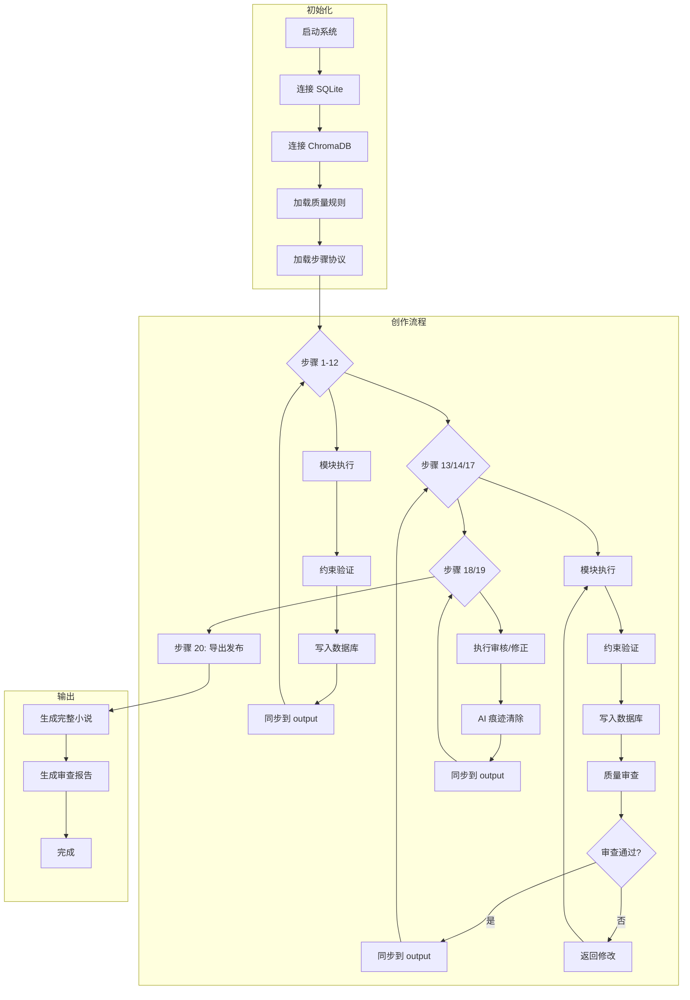
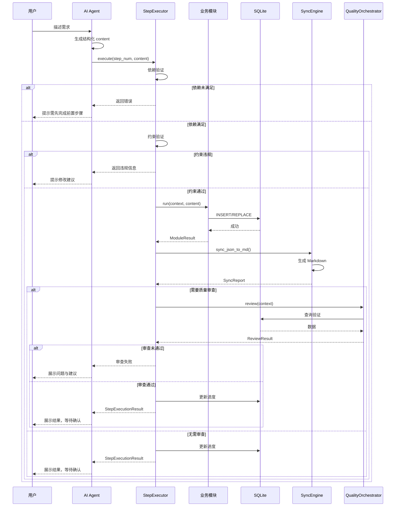
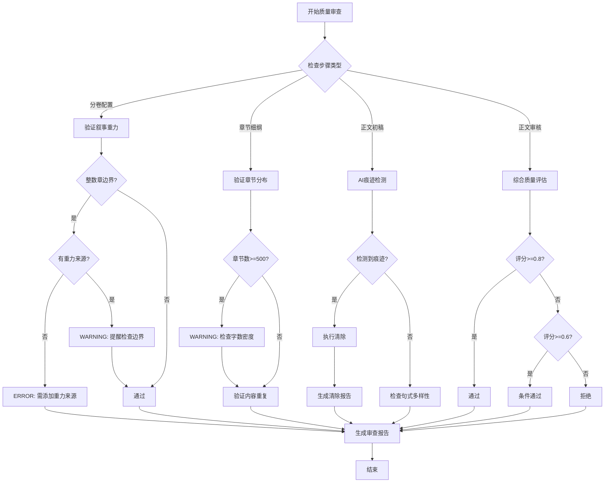
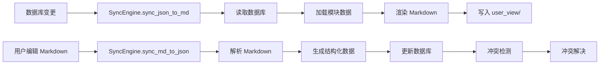

# AI 小说创作系统 — 项目流程与功能梳理

> **版本**: v3.0 (Agent-Native 原生版)
> **创建日期**: 2026-06-02
> **核心定位**: AI Agent 直接执行的技能式小说创作系统 + 用户可视中文 Markdown 双层架构

---

## 目录

1. [执行流程梳理](#一执行流程梳理)
2. [功能模块详解](#二功能模块详解)
3. [完整工作流](#三完整工作流)
4. [质量保障体系](#四质量保障体系)
5. [数据同步机制](#五数据同步机制)

---

## 一、执行流程梳理

### 1.1 整体执行框架

系统采用 **三明治交互模式**，每个环节必须经过四阶段：

```
展示计划 → 用户决策 → 执行 → 确认完成
    ↑                        ↑              ↑
必须展示完整计划      必须等待用户指令    必须等待用户确认
```

### 1.2 20 步创作管线

| 步号 | 环节名 | 模块名 | 需质检 | 依赖步骤 | 核心产出 |
|------|--------|--------|--------|----------|----------|
| 01 | 灵感启动 | theme_engine | 否 | — | 灵感方向列表 |
| 02 | 小说主题 | theme_engine | 否 | [1] | 主题设定（表层/深层/情感钩子） |
| 03 | 世界观设定 | world_builder | 否 | [2] | 维度规则、世界法则 |
| 04 | 人物设定 | character_builder | 否 | [3] | 人物四层档案 |
| 05 | 势力设定 | faction_builder | 否 | [3] | 势力组织架构 |
| 06 | 物品库 | item_builder | 否 | [3] | 关键物品清单 |
| 07 | 人物关系 | relation_builder | 否 | [4] | 人物关系网 |
| 08 | 势力关系 | faction_relation | 否 | [5] | 势力间关系 |
| 09 | 人物-势力关联 | char_faction_bridge | 否 | [4,5,7,8] | 人物隶属关系 |
| 10 | 角色弧线 | arc_builder | 否 | [4,7,9] | 人物成长轨迹 |
| 11 | 伏笔追踪 | foreshadow_manager | 否 | [4,5,6] | 伏笔埋点与回收计划 |
| 12 | 拟定大纲 | outline_builder | 否 | [1-11] | 三幕式结构大纲 |
| **13** | **分卷配置** | **volume_config** | **✅** | **[12]** | 卷划分与叙事节奏 |
| **14** | **章节细纲** | **detail_outline** | **✅** | **[13]** | 章节内容规划 |
| 15 | 小说档案 | archive_builder | 否 | [1-14] | 自动聚合档案 |
| 16 | 小说简介 | synopsis_builder | 否 | [15] | 多版本简介文案 |
| **17** | **正文初稿** | **manuscript_writer** | **✅** | **[14]** | 章节正文内容 |
| **18** | **正文审核** | **review_executor** | **✅** | **[17]** | 质量审查报告 |
| **19** | **正文修正** | **manuscript_fixer** | **✅** | **[18]** | 修正后正文 |
| 20 | 导出发布 | export_tool | 否 | [19] | 完整小说输出 |

### 1.3 单步执行流程

每步执行必须通过 `StepExecutor.execute()` 完成，内部流程如下：

```
┌─────────────────────────────────────────────────────────────┐
│                    StepExecutor.execute()                    │
├─────────────────────────────────────────────────────────────┤
│  1. 依赖验证                                                │
│     └── 检查前置步骤是否已完成（以 step_status 为准）          │
│                              ↓                              │
│  2. 约束验证                                                │
│     └── 分卷配置：禁止整数章强迫症、验证章节分布合理性         │
│     └── 正文初稿：检测内容重复                               │
│                              ↓                              │
│  3. 模块执行                                                │
│     └── 调用对应模块的 run(context, content)                │
│                              ↓                              │
│  4. 写入 system_data JSON                                  │
│     └── 确保同步引擎能读取最新数据                          │
│                              ↓                              │
│  5. 同步到 user_view/                                      │
│     └── 生成结构化 Markdown 文件                            │
│                              ↓                              │
│  6. 质量审查（如需）                                        │
│     └── 对步骤 13/14/17/18/19 强制执行质量审查              │
│                              ↓                              │
│  7. 更新进度                                                │
│     └── 更新 novels.current_step 和 step_status 表          │
└─────────────────────────────────────────────────────────────┘
```

---

## 二、功能模块详解

### 2.1 模块架构总览

```
src/core/modules/
├── base_module.py          # 基类：统一接口 run(context, content)
├── registry.py             # 模块注册表
├── theme_engine.py         # 主题引擎
├── world_builder.py        # 世界观构建器
├── character_builder.py    # 人物构建器
├── faction_builder.py      # 势力构建器
├── item_builder.py         # 物品构建器
├── relation_builder.py     # 人物关系构建器
├── faction_relation.py     # 势力关系构建器
├── char_faction_bridge.py  # 人物-势力关联桥接器
├── arc_builder.py          # 角色弧线构建器
├── foreshadow_manager.py   # 伏笔管理器
├── outline_builder.py      # 大纲构建器
├── volume_config.py        # 分卷配置器
├── detail_outline.py       # 章节细纲构建器
├── archive_builder.py      # 档案构建器
├── synopsis_builder.py     # 简介构建器
├── manuscript_writer.py    # 正文编写器
├── review_executor.py      # 审核执行器
├── manuscript_fixer.py     # 正文修正器
└── export_tool.py          # 导出工具
```

### 2.2 各模块核心能力

#### 2.2.1 主题引擎 (theme_engine)

**核心能力**:
- 灵感方向生成与评估
- 主题深度挖掘（表层/深层主题）
- 情感钩子设计
- 反向确认机制

**输出结构**:
```json
{
  "directions": [
    {"id": "DIR-001", "title": "身份重组", "concept": "..."}
  ],
  "theme": {
    "surface_theme": "...",
    "deep_theme": "...",
    "emotional_hook": "...",
    "theme_statement": "..."
  },
  "sub_themes": [{"name": "...", "core_question": "..."}]
}
```

#### 2.2.2 世界观构建器 (world_builder)

**核心能力**:
- 多维世界设定
- 规则系统设计
- 约束条件定义
- 世界法则一致性验证

**输出结构**:
```json
{
  "dimensions": [
    {
      "name": "魔法体系",
      "rules": [
        {"description": "...", "scope": "...", "constraints": "..."}
      ]
    }
  ]
}
```

#### 2.2.3 人物构建器 (character_builder)

**核心能力**:
- 四层人物档案构建（生理/心理/社会/历史）
- 人物权重分配
- 角色类型定义

**输出结构**:
```json
{
  "characters": [
    {
      "char_id": "CHAR-001",
      "name": "...",
      "role": "protagonist",
      "layer1": {...},  // 表层档案
      "layer2": {...},  // 心理档案
      "layer3": {...},  // 社会档案
      "layer4": {...},  // 深层秘密
      "weight": 1.0
    }
  ]
}
```

#### 2.2.4 势力构建器 (faction_builder)

**核心能力**:
- 势力层级架构设计
- 目标与资源配置
- 教义与声望管理

**输出结构**:
```json
{
  "factions": [
    {
      "faction_id": "FAC-001",
      "name": "...",
      "type": "religious",
      "hierarchy": {...},
      "goals": [...],
      "resources": {...},
      "doctrines": [...],
      "reputation": 0.8,
      "members": [...]
    }
  ]
}
```

#### 2.2.5 物品构建器 (item_builder)

**核心能力**:
- 关键物品设计
- 背景故事关联
- 剧情重要性评估

**输出结构**:
```json
{
  "items": [
    {
      "item_id": "ITEM-001",
      "name": "...",
      "type": "artifact",
      "purpose": "...",
      "background_story": "...",
      "restrictions": [...],
      "current_owner": "CHAR-001",
      "significance_to_plot": 1.0
    }
  ]
}
```

#### 2.2.6 关系构建器 (relation_builder / faction_relation)

**核心能力**:
- 人物/势力关系网络构建
- 关系强度量化
- 非对称性关系处理
- 历史轨迹追踪

**输出结构**:
```json
{
  "relations": [
    {
      "relation_id": "REL-001",
      "char_a_id": "CHAR-001",
      "char_b_id": "CHAR-002",
      "type": "rivalry",
      "strength": 0.9,
      "asymmetry": 0.3,
      "history": "...",
      "trajectory": "escalating"
    }
  ]
}
```

#### 2.2.7 角色弧线构建器 (arc_builder)

**核心能力**:
- 人物成长轨迹设计
- 触发事件定义
- 转变过程规划
- 章节映射

**输出结构**:
```json
{
  "arcs": [
    {
      "char_id": "CHAR-001",
      "arc_type": "redemption",
      "start_state": "...",
      "catalyst_event": "...",
      "change_process": [...],
      "end_state": "...",
      "chapter_mapping": [...]
    }
  ]
}
```

#### 2.2.8 伏笔管理器 (foreshadow_manager)

**核心能力**:
- 伏笔埋点设计
- 密度曲线规划
- 相似度去重（ChromaDB）
- 全生命周期追踪

**输出结构**:
```json
{
  "foreshadows": [
    {
      "foreshadow_id": "FORE-001",
      "type": "plot_twist",
      "status": "planted",
      "plant_chapter": 5,
      "payload": "...",
      "depth": 0.8,
      "importance": 1.0
    }
  ],
  "density_curve": [...]
}
```

#### 2.2.9 大纲构建器 (outline_builder)

**核心能力**:
- 三幕式结构设计
- 因果链梳理
- 节奏图谱规划

**输出结构**:
```json
{
  "acts": [
    {
      "title": "第一幕：觉醒",
      "chapters": [1, 20],
      "key_events": [...],
      "description": "..."
    }
  ],
  "causal_chain": [...],
  "rhythm_map": [...]
}
```

#### 2.2.10 分卷配置器 (volume_config)

**核心能力**:
- 叙事重力边界定义
- 章节范围规划
- 节奏控制
- 悬念设计

**强制约束**:
- 禁止整数章强迫症
- 必须提供分卷重力来源

**输出结构**:
```json
{
  "volumes": [
    {
      "name": "弃子觉醒",
      "chapter_range": [1, 40],
      "boundary_gravity": [
        {"type": "narrative_gravity", "description": "..."}
      ],
      "pacing": "fast",
      "major_conflict": "...",
      "character_focus": ["CHAR-001"],
      "themes": ["命运觉醒"],
      "cliffhanger": "..."
    }
  ]
}
```

#### 2.2.11 章节细纲构建器 (detail_outline)

**核心能力**:
- 章节内容规划
- POV 角色分配
- 场景设计

**输出结构**:
```json
{
  "chapters": [
    {
      "chapter_number": 1,
      "pov_character": "CHAR-001",
      "summary": "...",
      "scenes": [...]
    }
  ]
}
```

#### 2.2.12 正文编写器 (manuscript_writer)

**核心能力**:
- 章节内容生成
- 场景描写
- 字数控制
- AI 痕迹检测前置处理

**输出结构**:
```json
{
  "chapters": [
    {
      "chapter_number": 1,
      "title": "弃子",
      "scenes": [{"pov_char_id": "CHAR-001", "content": "..."}],
      "word_count": 3000
    }
  ]
}
```

---

## 三、完整工作流

### 3.1 工作流架构图



### 3.2 单环节交互流程



### 3.3 质量审查决策流程



---

## 四、质量保障体系

### 4.1 审查层级

| 级别 | 名称 | 处理方式 | 示例 |
|------|------|----------|------|
| BLOCKER | 阻塞 | 必须修复才能继续 | 内容重复、约束违规 |
| ERROR | 错误 | 建议修复，可跳过 | 严重逻辑矛盾 |
| WARNING | 警告 | 建议优化 | 句式单调、词汇重复 |
| INFO | 信息 | 参考建议 | 风格建议 |

### 4.2 质量审查规则

**规则分类**:
1. **结构规则** - 叙事结构、章节分布、节奏控制
2. **内容规则** - 逻辑一致性、伏笔回收、人物弧线
3. **语言规则** - 句式多样性、词汇丰富度、情感表达
4. **AI痕迹规则** - 检测并清除 AI 写作特征

### 4.3 AI 痕迹检测与清除

**检测特征**:
- 句式单调性（连续相似结构）
- 过渡词滥用（"然而"、"因此"过度使用）
- 情感描述空洞（"非常高兴"而非具体表现）
- 比喻陈腐（"像雪一样白"等）
- 对话不自然（缺乏口语特征）
- 描述模式化（固定的描写套路）

**清除策略**:
1. **一级清除** - 自动修复轻微问题（词汇替换、句式调整）
2. **二级清除** - 半自动修复中等问题（需要人工确认）
3. **三级清除** - 人工审查修复严重问题

---

## 五、数据同步机制

### 5.1 双层架构

```
┌─────────────────────────────────────────────────────────────┐
│                    用户可视层 (user_view/)                   │
│                         Markdown                            │
│  ├── 小说概览.md                                           │
│  ├── 01_主题/01_主题.md                                    │
│  ├── 02_世界观/02_世界观.md                                 │
│  ├── ...                                                   │
│  └── 审查报告/                                             │
├─────────────────────────────────────────────────────────────┤
│                    系统引擎层 (system_data/)                  │
│                          JSON                               │
│  ├── novel_manifest.json                                   │
│  ├── modules/                                             │
│  │   ├── theme/theme.json                                  │
│  │   ├── world/rules/RULE-001.json                         │
│  │   ├── characters/CHAR-001.json                          │
│  │   └── ...                                               │
│  └── structure/                                            │
│      ├── outlines.json                                     │
│      ├── volumes.json                                      │
│      └── detail_outlines.json                              │
└─────────────────────────────────────────────────────────────┘
```

### 5.2 同步流程



### 5.3 输出目录结构

```
output/{小说标题}/
├── 01 主题/01_主题.md
├── 02 世界观/02_世界观.md
├── 03 势力/03_势力.md
├── 04 势力关系/04_势力关系.md
├── 05 人物/05_人物.md
├── 06 人物关系/06_人物关系.md
├── 07 角色弧线/07_角色弧线.md
├── 08 物品仓库/08_物品仓库.md
├── 09 伏笔管理/09_伏笔管理.md
├── 10 大纲/10_大纲.md
├── 11 分卷/11_分卷.md
├── 12 细纲/12_细纲.md
├── 13 正文/13_正文.md
├── 审查报告/
│   ├── 质量审查报告.md
│   └── AI痕迹清除报告.md
└── 小说概览.md
```

---

## 附录：关键约束规则

### A.1 分卷约束
- 分卷不以整数为边界，以叙事重力为边界
- 每卷必须有 `boundary_gravity` 说明叙事重力来源
- 章节数超过 500 章时需验证字数密度

### A.2 正文约束
- 每章至少 1500-3000 字
- 禁止章节内容重复
- 必须注入 `manuscript_writer.md` 全部规则

### A.3 执行约束
- 必须通过 `StepExecutor.execute()` 执行每步
- 禁止直接操作数据库
- 禁止跳过质量审查步骤（13/14/17/18/19）
- 每次只执行一个步骤，用户确认后才能进入下一步